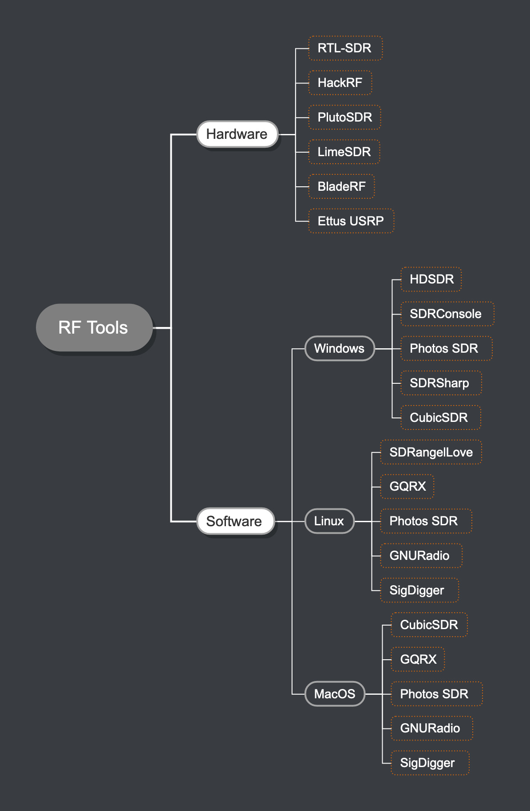

# RFSec List

If you are a macOS user and you need to use cmake, remember to add the install prefix to avoid errors:

```
cmake -DCMAKE_INSTALL_PREFIX=/opt/local ../
```

<center></center>

# Index

- [Hardware](#hardware)
- [Software](#software)
	- [Mobile Communications](#mobile-communications)
		- [4G - LTE](#4g---lte)
		- [3G - UMTS](#3g---umts)
		- [2G - GSM](#2g---gsm)
		- [SIM/USIM](#simusim)
	- [SDR Software](#sdr-software)
	- [RF Tools](#rf-tools)
	- [ADB-S](#adb-s)
	- [GNURadio](#gnuradio)
	- [Dockers](#dockers)
- [CTF Tools](#ctf-tools)
# Hardware

- [RTL2832U](https://github.com/osmocom/rtl-sdr): RTL-SDR is a very cheap software defined radio that uses a DVB-T TV tuner dongle based on the RTL2832U chipset. 

- [HackRF](https://greatscottgadgets.com): low cost software radio platform.
	- [Opera cake](https://github.com/mossmann/hackrf/wiki/Opera-Cake): (sometimes operacake) is an antenna switching add on board for HackRF.

- [USRP](https://github.com/EttusResearch/uhd): The USRP software defined radio products are designed for RF applications from DC to 6 GHz, including multiple antenna (MIMO) systems.

- [BladeRF](https://github.com/Nuand/bladeRF): BladeRF is a Software Defined Radio (SDR) platform designed to enable a community of hobbyists, and professionals to explore and experiment with the multidisciplinary facets of RF communication.  [Nuand.com](http://nuand.com/)

- [LimeSDR](https://github.com/myriadrf):LimeSDR is a low cost, open source, apps-enabled software defined radio (SDR) platform that can be used to support just about any type of wireless communication standard. [Lime Microsystems](http://www.limemicro.com/)

- [PlutoSDR](https://github.com/analogdevicesinc/plutosdr-fw): PlutoSDR Firmware for the ADALM-PLUTO Active Learning Module. [Adalm Pluto](https://www.analog.com/en/design-center/evaluation-hardware-and-software/evaluation-boards-kits/adalm-pluto.html#eb-overview)

- [Proxmark](https://proxmark.com/): The Proxmark is an RFID swiss-army tool, allowing for both high and low level interactions with the vast majority of RFID tags and systems world-wide. Originally built by Jonathan Westhues over 10 years ago, the device has progressively evolved into the industry standard tool for RFID Analysis.

- [ChameleonMini/Tiny](): Powerful and portable RFID Emulation multi-tool with Bluetooth functionality.

# Software

## Mobile Communications

### 4G - LTE

- [OpenLTE](https://sourceforge.net/p/openlte/wiki/Home/): An open source implementation of the 3GPP LTE specifications. USRP recommended. [+ OpenLTE Manual](https://github.com/mgp25/OpenLTE#contents). Clone with documentation in [mgp25/OpenLTE](https://github.com/mgp25/OpenLTE).

- [OpenAirInterface](https://gitlab.eurecom.fr/oai/openairinterface5g/wikis/home#welcome-to-the-openairinterface-project): a separate legal entity from EURECOM, which aims to provide an open-source ecosystem for the core (EPC) and access-network (EUTRAN) protocols of 3GPP cellular systems with the possibility of interoperating with closed-source equipment in either portion of the network.

- [OpenAirInterface5G](https://gitlab.eurecom.fr/oai/openairinterface5g): OpenAirInterface 5G Wireless Implementation.

- [srsLTE](https://github.com/srsLTE/srsLTE): Open source SDR LTE software suite.

- [IMDEA-OWL](https://git.networks.imdea.org/nicola_bui/imdeaowl/tree/master): OWL stands for Online Watcher of LTE. imdeaOWL is a free and open-source LTE control channel decoder developed by IMDEA Networks Institute and based on srsLTE, an LTE library for SDR UE and eNodeB developed by SRS

- [LTE Cell Scanner](https://github.com/JiaoXianjun/LTE-Cell-Scanner): OpenCL, SDR, TDD/FDD LTE cell scanner. [+ Detected cells somewhere in Madrid, Spain](https://github.com/mgp25/RF-List/blob/master/Mobile%20Communications/4G/LTE%20Cells%20detected%20in%20Madrid%20-%20Spain.pdf)

### 3G - UMTS

- [OpenUMTS](https://github.com/mgp25/OpenBTS-UMTS
): An open source implementation of the 3GPP UMTS specifications. [+ OpenUMTS Manual](https://github.com/mgp25/OpenBTS-UMTS#contents)

### 2G - GSM

- [OpenBTS](https://github.com/RangeNetworks/openbts): GSM+GPRS Radio Access Network Node.

- [YateBTS](http://yatebts.com/): YateBTS is a software implementation of a GSM/GPRS radio access network based on Yate and is compatible with both GSM/GPRS SS7 MAP and LTE IMS core networks integrated in our YateUCN unified core network server.
	- [evilBTS](https://github.com/security-geeks/evilbts): Yate and YateBTS specific versions ( plus patches ) that are working with the BladeRF by [@evilsocket](https://github.com/evilsocket).

- [FakeBTS](http://fakebts.com/): The aim of FakeBTS project is to detect fake BTS stations and prevent attacks, using a Linux computer and hardware that allows us to scan the frequencies of GSM/GPRS.

- [IMSI Catcher](https://github.com/Oros42/IMSI-catcher): This program show you IMSI numbers of cellphones around you.

### SIM/USIM

- [pySim](https://git.osmocom.org/pysim): Python-language program that can be used to program (write) certain fields/parameters on so-called programmable SIM/USIM cards.

- [sysmo-usim-tool](https://git.sysmocom.de/sysmo-usim-tool/about/): Python language utility to configure the vendor-specific parameters of sysmoUSIM-SJS1 programmable USIM cards.

- [OPC Calculator](https://github.com/mgp25/RF-List/blob/master/Mobile%20Communications/SIM-USIM/opc_calc.py): Python script that calculates OPC from Ki and OP values.
 

### SDR SoftWare

- **[SigDigger](https://github.com/BatchDrake/SigDigger)**: Qt-based digital signal analyzer, using Suscan core and Sigutils DSP library. ⭐️⭐️⭐️ **(My personal favorite and has MacOs Support ♥️).**

- [GQRX](https://github.com/csete/gqrx): Software defined radio receiver powered by GNU Radio and Qt

- [SDRSharp](http://airspy.com/download/): Airspy is a popular, affordable SDR (software defined radio) based communication receiver with the highest performance and the smallest form factor. It is a serious alternative to both cost sensitive and higher end scanners while featuring the best radio browsing experience of the market thanks to the tight integration with the de facto standard SDR# software.[@airspy_com](https://twitter.com/airspy_com)

- [SDR_Console](http://sdr-radio.com/v3_help): SDR-Radio.com is a Windows console for Software Defined Radio (SDR) receivers and transceivers. Designed for the commercial, government, amateur radio and short-wave listener communities, the software provides a powerful interface for all SDR users. [Suport Hardware List](http://sdr-radio.com/Radios)

- [HDSDR](http://www.hdsdr.de/): HDSDR is a freeware Software Defined Radio (SDR) program for Microsoft Windows 2000/XP/Vista/7/8/8.1/10.

- [CubicSDR](https://github.com/cjcliffe/CubicSDR): Cross-Platform Software-Defined Radio Application 

- [sdrangel](https://github.com/f4exb/sdrangel): SDR Rx/Tx software for Airspy, BladeRF, HackRF, LimeSDR, RTL-SDR, SDRplay RSP1 and FunCube

- [shinysdr](https://github.com/kpreid/shinysdr): Software-defined radio receiver application built on GNU Radio with a web-based UI and plugins. In development, usable but incomplete. Compatible with RTL-SDR.

- [openwebrx](https://github.com/simonyiszk/openwebrx): Open source, multi-user SDR receiver software with a web interface.

- [luaradio](https://github.com/vsergeev/luaradio): A lightweight, embeddable software-defined radio framework built on LuaJIT.

- [qspectrumanalyzer](https://github.com/xmikos/qspectrumanalyzer): Spectrum analyzer for multiple SDR platforms (PyQtGraph based GUI for soapy_power, hackrf_sweep, rtl_power, rx_power and other backends)

- [PandwaRF](https://github.com/ComThings/PandwaRF): PandwaRF: RF analysis tool with a sub-1 GHz wireless transceiver controlled by a smartphone.

- [PSDR](https://github.com/MichaelRColton/PSDR): PortableSDR - A Stand Alone HF Software Defined Transciever.

- [spektrum](https://github.com/pavels/spektrum): Spektrum is spectrum analyzer software for use with rtl-sdr.

- [OpenUSRP](https://github.com/jocover/OpenUSRP): Using LimeSDR to simulate USRP B210,OpenUSRP can using LimeSDR to simulate USRP B210 Device

- [kalibrate-rtl](https://github.com/steve-m/kalibrate-rtl): GSM frequency scanner and frequency offset calculator use with rtl-sdr devices

- [kalibrate-hackrf](https://github.com/scateu/kalibrate-hackrf): kalibrate for hackrf

- [kalibrate-bladeRF](https://github.com/Nuand/kalibrate-bladeRF): kalibrate for bladeRF

## RF Tools

- [Audacity](http://www.audacityteam.org/): Audacity is free, open source, cross-platform audio software for multi-track recording and editing.

- [Baudline](http://www.baudline.com/): Baudline is a time-frequency browser designed for scientific visualization of the spectral domain. Signal analysis is performed by Fourier, correlation, and raster transforms that create colorful spectrograms with vibrant detail.

- [Inspectrum](https://github.com/miek/inspectrum): Inspectrum is a tool for analysing captured signals, primarily from software-defined radio receivers.

- [Dspectrum](https://github.com/tresacton/dspectrum): Automated RF/SDR Signal Analysis.

- [rtl_433](https://github.com/merbanan/rtl_433) :Application using librtlsdr to decode the temperature from a wireless temperature sensor.

- [ooktools](https://github.com/leonjza/ooktools) :On-off keying tools for your SDR.

- [TempestSDR](https://github.com/martinmarinov/TempestSDR): 
Remote video eavesdropping using a software-defined radio platform.

- [gps-sdr-sim](https://github.com/osqzss/gps-sdr-sim): GPS-SDR-SIM generates GPS baseband signal data streams, which can be converted to RF using software-defined radio (SDR) platforms, such as bladeRF, HackRF, and USRP.

- [proxmark3](https://github.com/RfidResearchGroup/proxmark3): RRG / Iceman repo, the most totally wicked repo around if you are into Proxmark3 and RFID hacking.

- [ChameleonMini](https://github.com/RfidResearchGroup/ChameleonMini):  The ChameleonMini is a versatile contactless smartcard emulator compliant to NFC.

## ADS-B

- [dump1090_sdrplus](https://github.com/itemir/dump1090_sdrplus): Dump1090_sdrplus is a Mode S decoder for Software Defined Radio (SDR) devices including RTL SDR, HackRF, Airspy and SDRplay.

- [pyModeS](https://github.com/junzis/pyModeS):  The Python Decoder for ADS-B (DF17) and Enhance Mode-S (DF20/21).

- [Mode S](http://mode-s.org/decode/adsb/introduction.html): An Open access book on Mode-S/ADS-B decoding and related topics.

- [graphs1090](https://github.com/wiedehopf/graphs1090): Graphs for dump1090-fa (based on dump1090-tools by mutability)


## GNURadio

- [gr-tempest](https://github.com/git-artes/gr-tempest): An implementation of TEMPEST in GNU Radio.

- [gr-gsm](https://github.com/ptrkrysik/gr-gsm): 
GNUradio blocks and tools for receiving GSM transmissions.

- [gr-lte](https://github.com/kit-cel/gr-lte): The gr-lte project is an Open Source Software Package which aims to provide a GNU Radio LTE Receiver to receive, synchronize and decode LTE signals.

- [gr-correctiq](https://github.com/ghostop14/gr-correctiq): GNURadio blocks to remove that IQ DC spike just like some software and drivers do! Three techniques available: auto, auto-tune to dc offset, and manual.

- [gr-cc11xx](https://github.com/andrepuschmann/gr-cc11xx): GNU Radio OOT module for communicating with TI CC11xx based devices.

## Dockers

- [Ooktools](https://hub.docker.com/r/treemo/ooktools): `docker run -it --rm --privileged -v $(pwd):/data treemo/ooktools`

# CTF Tools

- [CTS Tools](https://github.com/capturethesignal/cts-tools): These are client tools used to connect to the CTS infrastructure and receive RF data (IQ samples) over IP. They need a working GNU Radio 3.7 installation, they're headless, and are configured via command-line options.
